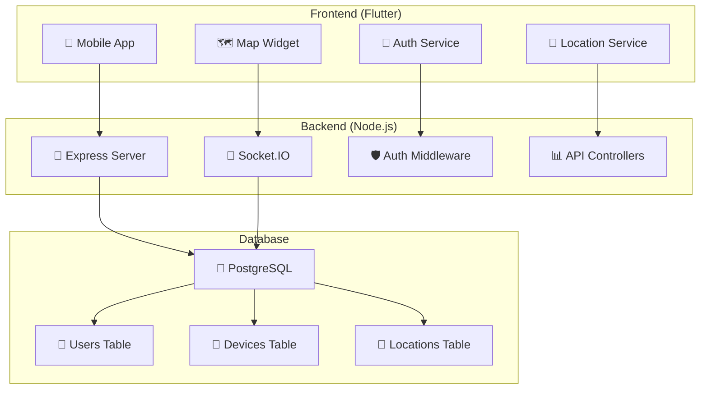
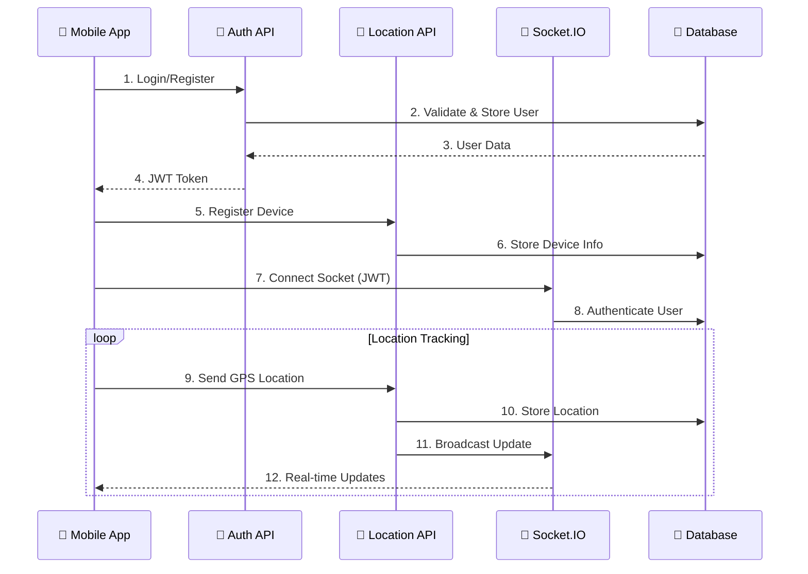

# 🌍 Geolocation Tracking App

> A comprehensive real-time geolocation tracking application with Flutter frontend and Node.js backend

[](https://flutter.dev/)
[](https://nodejs.org/)
[](https://postgresql.org/)
[](https://socket.io/)

## 📋 Table of Contents

- [🚀 Features](#-features)
- [🏗️ Architecture](#️-architecture)
- [📁 Project Structure](#-project-structure)
- [⚡ Quick Start](#-quick-start)
- [🔧 Installation](#-installation)
- [🐳 Docker Setup](#-docker-setup)
- [📱 Mobile APK Build](#-mobile-apk-build)
- [📚 Documentation](#-documentation)
- [🤝 Contributing](#-contributing)

## 🚀 Features

### ✅ Implemented
- **🔐 User Authentication**: Register, login, logout with JWT
- **📱 Device Management**: Automatic device registration and tracking
- **📍 Real-time Location Tracking**: GPS-based location updates
- **🗺️ Interactive Map**: OpenStreetMap integration with markers
- **🔄 Live Updates**: Socket.IO real-time communication
- **📊 Location History**: Store and retrieve location data
- **👥 Multi-user Support**: Isolated user sessions and data
- **🛡️ Security**: Input validation, authentication middleware
- **📦 Database**: PostgreSQL with Sequelize ORM

### 🔮 Future Enhancements
- **🏡 Geofencing**: Location-based alerts and notifications
- **📈 Analytics Dashboard**: Location statistics and insights
- **🌐 Web Dashboard**: Web-based admin interface
- **🔔 Push Notifications**: Real-time alerts

## 🏗️ Architecture



### 🔄 Data Flow



## 📁 Project Structure

```
📦 geolocation-app/
├── 📱 geo_app/                 # Flutter Mobile Application
│   ├── 📂 lib/
│   │   ├── 🏠 main.dart
│   │   ├── 📄 models/          # Data models
│   │   ├── 📱 screens/         # UI screens
│   │   ├── 🔧 services/        # API & Location services
│   │   └── 🎨 widgets/         # Reusable components
│   ├── 📄 pubspec.yaml
│   └── 🤖 android/
├── 🖥️ backend/                 # Node.js Backend Server
│   ├── 📂 src/
│   │   ├── 🛠️ api/             # Controllers & Routes
│   │   ├── 🗃️ models/          # Database models
│   │   ├── 🔒 middlewares/     # Auth & validation
│   │   ├── ⚙️ services/        # Business logic
│   │   └── ⚙️ config/          # Configuration
│   ├── 📄 package.json
│   ├── 🐳 Dockerfile
│   └── 🔧 .env.example
├── 📚 docs/                    # Documentation
│   ├── 📋 API.md
│   ├── 🏗️ ARCHITECTURE.md
│   ├── 🔧 SETUP.md
│   └── 🚀 DEPLOYMENT.md
├── 🐳 docker-compose.yml
└── 📖 README.md
```

## ⚡ Quick Start

### 🔧 Prerequisites

- **Flutter SDK**: 3.19.0 or later
- **Node.js**: 18.0.0 or later
- **PostgreSQL**: 15.0 or later
- **Docker** (optional): Latest version
- **Git**: Latest version

### 🚀 1-Minute Setup with Docker

```bash
# Clone the repository
git clone <repository-url>
cd geolocation-app

# Start everything with Docker
docker-compose up -d

# The backend will be available at http://localhost:3000
# The database will be automatically set up
```

## 🔧 Installation

### 🖥️ Backend Setup

1. **Navigate to backend directory**:
   ```bash
   cd backend
   ```

2. **Install dependencies**:
   ```bash
   npm install
   ```

3. **Environment configuration**:
   ```bash
   cp .env.example .env
   ```
   
   Edit `.env` with your configuration:
   ```env
   PORT=3000
   JWT_SECRET=your_super_secret_jwt_key_here
   JWT_EXPIRES_IN=24h
   
   # Database Configuration
   DB_HOST=localhost
   DB_PORT=5432
   DB_NAME=geolocation_db
   DB_USER=postgres
   DB_PASSWORD=password
   
   # Socket.IO Configuration
   SOCKET_CORS_ORIGIN=*
   ```

4. **Database setup**:
   ```bash
   # Create database
   createdb geolocation_db
   
   # Run migrations
   npm run db:migrate
   
   # Seed database (optional)
   npm run db:seed
   ```

5. **Start the server**:
   ```bash
   # Development mode
   npm run dev
   
   # Production mode
   npm start
   ```

### 📱 Frontend Setup

1. **Navigate to Flutter app directory**:
   ```bash
   cd geo_app
   ```

2. **Install dependencies**:
   ```bash
   flutter pub get
   ```

3. **Configure API endpoints** (if different from default):
   Edit `lib/services/auth_service.dart` and `lib/services/location_service.dart`:
   ```dart
   static const String baseUrl = 'http://10.0.2.2:3000/api'; // Android emulator
   // static const String baseUrl = 'http://localhost:3000/api'; // iOS simulator
   ```

4. **Run the app**:
   ```bash
   # Check connected devices
   flutter devices
   
   # Run on connected device/emulator
   flutter run
   
   # Run with hot reload
   flutter run --hot
   ```

## 🐳 Docker Setup

### 🎯 Complete Docker Environment

1. **Clone and navigate**:
   ```bash
   git clone <repository-url>
   cd geolocation-app
   ```

2. **Environment setup**:
   ```bash
   cp backend/.env.example backend/.env
   ```

3. **Start all services**:
   ```bash
   # Start in background
   docker-compose up -d
   
   # View logs
   docker-compose logs -f
   
   # Stop services
   docker-compose down
   ```

### 🔧 Docker Services

- **🖥️ Backend API**: `http://localhost:3000`
- **🐘 PostgreSQL**: `localhost:5432`
- **📊 pgAdmin** (optional): `http://localhost:5050`

### 🛠️ Docker Commands

```bash
# Rebuild services
docker-compose build --no-cache

# View running containers
docker-compose ps

# Access backend container
docker-compose exec backend sh

# View database logs
docker-compose logs postgres

# Reset database
docker-compose down -v
docker-compose up -d
```

## 📱 Mobile APK Build

### 🔨 Debug APK (Testing)

```bash
cd geo_app
flutter build apk --debug
```

### 🚀 Release APK (Production)

1. **Configure signing** (optional):
   ```bash
   # Generate keystore
   keytool -genkey -v -keystore ~/upload-keystore.jks \
           -keyalg RSA -keysize 2048 -validity 10000 \
           -alias upload
   ```

2. **Build release APK**:
   ```bash
   flutter build apk --release
   ```

3. **Install on device**:
   ```bash
   # Via ADB
   adb install build/app/outputs/flutter-apk/app-release.apk
   
   # Or transfer file to device and install manually
   ```

### 📦 App Bundle (Play Store)

```bash
flutter build appbundle --release
```

## 📚 Documentation

| Document | Description |
|----------|-------------|
| [🏗️ Architecture](./docs/ARCHITECTURE.md) | System design and component interactions |
| [📋 API Reference](./docs/API.md) | Complete API endpoints documentation |
| [🛠️ Development Guide](./docs/DEVELOPMENT.md) | Development environment setup and guidelines |
| [🚀 Deployment Guide](./docs/DEPLOYMENT.md) | Production deployment guide |
| [📊 Project Summary](./docs/PROJECT_SUMMARY.md) | Complete project overview and status |

## 🤝 Contributing

1. **🍴 Fork the repository**
2. **🌿 Create feature branch**: `git checkout -b feature/amazing-feature`
3. **💾 Commit changes**: `git commit -m 'Add amazing feature'`
4. **📤 Push to branch**: `git push origin feature/amazing-feature`
5. **📋 Open Pull Request**

### 📝 Development Guidelines

- Follow Flutter and Node.js best practices
- Write descriptive commit messages
- Add tests for new features
- Update documentation as needed
- Ensure code passes linting checks

### 🧪 Running Tests

```bash
# Backend tests
cd backend && npm test

# Frontend tests
cd geo_app && flutter test
```

---

## 📞 Support & Contact

For questions, support, or collaboration:

**👨‍💻 Developer & Maintainer:**
- **Juan Carlos Andrade Unigarro**
- 📧 **Primary Email**: jandradeu@unal.edu.co
- 📧 **Alternative Email**: andradeunigarrojuancarlos@gmail.com
- 🏫 **Institution**: Universidad Nacional de Colombia
- 📚 **Course**: Redes 2025

**📋 Project Resources:**
- 🐛 **Bug Reports**: Create GitHub Issues
- 📖 **Documentation**: Check `/docs` folder
- 💬 **Questions**: Contact via email above

---

**Built with ❤️ for real-time location tracking**  
**© 2025 Juan Carlos Andrade Unigarro - Universidad Nacional de Colombia**

**🌟 Star this repo** if you find it helpful!
