# 🏗️ Architecture Documentation

## System Overview

The Geolocation Tracking App follows a modern **Client-Server Architecture** with real-time capabilities, built to handle multiple users and devices efficiently.

## 🎯 Core Components

### Frontend (Flutter)
- **Mobile Application**: Cross-platform Flutter app
- **State Management**: Built-in Flutter state management
- **Real-time Communication**: Socket.IO client
- **Map Integration**: OpenStreetMap with flutter_map
- **Location Services**: Geolocator plugin

### Backend (Node.js)
- **API Server**: Express.js REST API
- **Real-time Engine**: Socket.IO server
- **Authentication**: JWT-based authentication
- **Database ORM**: Sequelize with PostgreSQL
- **Validation**: Joi schema validation

### Database (PostgreSQL)
- **Users**: User accounts and authentication
- **Devices**: Device registration and metadata
- **Locations**: GPS coordinates and timestamps

## 🔧 Detailed Architecture

```mermaid
graph TB
    subgraph "Mobile Client Layer"
        A[📱 Flutter App]
        A1[🗺️ Map Screen]
        A2[🔐 Auth Screen]
        A3[📊 Dashboard]
        A4[⚙️ Settings]
    end
    
    subgraph "Service Layer"
        B[🌐 Auth Service]
        C[📍 Location Service]
        D[🔌 Socket Service]
        E[🗃️ Storage Service]
    end
    
    subgraph "Network Layer"
        F[📡 HTTP Client]
        G[🔌 Socket.IO Client]
        H[🔄 Request Interceptors]
    end
    
    subgraph "Backend API Layer"
        I[🚀 Express Server]
        J[🛡️ Auth Middleware]
        K[✅ Validation Middleware]
        L[📝 Logging Middleware]
    end
    
    subgraph "Controller Layer"
        M[👤 Auth Controller]
        N[📱 Device Controller]
        O[📍 Location Controller]
    end
    
    subgraph "Service Layer Backend"
        P[🔐 Auth Service]
        Q[📊 Location Service]
        R[🔌 Socket Handler]
    end
    
    subgraph "Data Layer"
        S[🐘 PostgreSQL]
        T[👥 Users Table]
        U[📱 Devices Table]
        V[📍 Locations Table]
    end
    
    A --> A1
    A --> A2
    A --> A3
    A --> A4
    
    A1 --> C
    A2 --> B
    A3 --> C
    A3 --> D
    
    B --> F
    C --> F
    D --> G
    
    F --> I
    G --> I
    
    I --> J
    I --> K
    I --> L
    
    J --> M
    K --> N
    L --> O
    
    M --> P
    N --> Q
    O --> Q
    
    P --> S
    Q --> S
    R --> S
    
    S --> T
    S --> U
    S --> V
```



## 🔄 Data Flow Diagrams

### Authentication Flow

```mermaid
sequenceDiagram
    participant U as 👤 User
    participant A as 📱 App
    participant API as 🚀 Backend API
    participant DB as 🐘 Database
    participant JWT as 🔐 JWT Service
    
    U->>A: Enter credentials
    A->>API: POST /auth/login
    API->>DB: Validate user
    DB-->>API: User data
    API->>JWT: Generate token
    JWT-->>API: JWT token
    API-->>A: {user, token}
    A->>A: Store token locally
    A-->>U: Navigate to dashboard
```



### Location Tracking Flow

```mermaid
sequenceDiagram
    participant A as 📱 App
    participant GPS as 🛰️ GPS
    participant API as 🚀 Backend API
    participant DB as 🐘 Database
    participant S as 🔌 Socket.IO
    participant C as 📱 Other Clients
    
    A->>GPS: Request location
    GPS-->>A: GPS coordinates
    A->>API: POST /locations
    API->>DB: Store location
    DB-->>API: Location saved
    API->>S: Broadcast location
    S-->>C: Real-time update
    API-->>A: Success response
```



### Device Registration Flow

```mermaid
sequenceDiagram
    participant A as 📱 App
    participant D as 📱 Device Info
    participant API as 🚀 Backend API
    participant DB as 🐘 Database
    
    A->>D: Get device info
    D-->>A: Device metadata
    A->>API: POST /devices
    API->>DB: Check existing device
    DB-->>API: Device status
    alt Device exists
        API->>DB: Update device
    else New device
        API->>DB: Create device
    end
    DB-->>API: Device data
    API-->>A: Device ID
```



## 🗃️ Database Schema


## 🔐 Security Architecture

### Authentication & Authorization

```mermaid
graph TB
    A[📱 Client Request] --> B{🔑 Has Token?}
    B -->|No| C[🚫 Unauthorized 401]
    B -->|Yes| D[🔍 Validate JWT]
    D --> E{✅ Valid Token?}
    E -->|No| F[🚫 Forbidden 403]
    E -->|Yes| G[📊 Extract User Info]
    G --> H[🔒 Check Permissions]
    H --> I[✅ Process Request]
```



### Data Protection Layers

1. **Transport Security**: HTTPS/WSS encryption
2. **Authentication**: JWT tokens with expiration
3. **Authorization**: User-specific data access
4. **Input Validation**: Joi schema validation
5. **SQL Injection Protection**: Sequelize ORM
6. **Rate Limiting**: Request throttling
7. **CORS Protection**: Controlled origin access

## 🚀 Scalability Considerations

### Horizontal Scaling


### Performance Optimizations

- **Database Indexing**: Location coordinates, timestamps
- **Connection Pooling**: PostgreSQL connection management
- **Caching Strategy**: Redis for frequent queries
- **Real-time Optimization**: Socket.IO rooms for user isolation
- **Mobile Optimization**: Efficient location update intervals

## 🔌 API Design Patterns

### RESTful Endpoints

```
📊 Resources:
├── 👤 /api/auth         # Authentication
├── 📱 /api/devices      # Device management
├── 📍 /api/locations    # Location data
└── 👥 /api/users        # User management

🔗 HTTP Methods:
├── GET     # Retrieve data
├── POST    # Create new resources
├── PUT     # Update existing resources
└── DELETE  # Remove resources
```

### WebSocket Events

```javascript
// Client to Server Events
🔌 Socket Events:
├── 'join'              # Join user room
├── 'location-update'   # Send location
├── 'device-status'     # Device status update
└── 'ping'             # Connection health check

// Server to Client Events
📡 Broadcast Events:
├── 'location-update'   # Location broadcast
├── 'geofence-event'   # Geofence alerts
├── 'device-status'    # Device status
└── 'pong'             # Health check response
```

## 🧪 Testing Strategy

### Testing Pyramid

```mermaid
graph TB
    A[🔬 Unit Tests] --> B[🔧 Integration Tests]
    B --> C[🌐 E2E Tests]
    
    A1[Backend Services] --> A
    A2[Frontend Components] --> A
    
    B1[API Endpoints] --> B
    B2[Database Operations] --> B
    B3[Socket Communication] --> B
    
    C1[User Workflows] --> C
    C2[Cross-platform Tests] --> C
```



### Test Coverage Goals

- **Unit Tests**: 80%+ coverage
- **Integration Tests**: Critical paths
- **E2E Tests**: Main user journeys
- **Performance Tests**: Load testing
- **Security Tests**: Vulnerability scanning

## 📊 Monitoring & Observability

### Logging Strategy

```mermaid
graph LR
    A[📱 Mobile App] --> B[📝 Client Logs]
    C[🚀 Backend API] --> D[📊 Server Logs]
    E[🐘 Database] --> F[🗃️ Query Logs]
    
    B --> G[📈 Analytics Platform]
    D --> G
    F --> G
    
    G --> H[🔔 Alerting System]
    G --> I[📊 Dashboards]
```



### Key Metrics

- **User Metrics**: Active users, session duration
- **Performance Metrics**: Response times, throughput
- **Error Metrics**: Error rates, failure patterns
- **Business Metrics**: Location updates, device registrations

## 🚀 Deployment Architecture

```mermaid
graph TB
    subgraph "Development"
        DEV[💻 Local Development]
    end
    
    subgraph "Staging"
        STAGE[🧪 Staging Environment]
    end
    
    subgraph "Production"
        PROD[🌟 Production Environment]
        CDN[🌐 CDN]
        LB[⚖️ Load Balancer]
        APP[🚀 App Servers]
        DB[🐘 Database Cluster]
        CACHE[📊 Redis Cache]
    end
    
    DEV --> STAGE
    STAGE --> PROD
    
    CDN --> LB
    LB --> APP
    APP --> DB
    APP --> CACHE
```



## 🔮 Future Architecture Considerations

### Microservices Evolution

```mermaid
graph TB
    subgraph "Current Monolith"
        MONO[🏢 Single Backend Service]
    end
    
    subgraph "Future Microservices"
        AUTH[🔐 Auth Service]
        LOC[📍 Location Service]
        DEVICE[📱 Device Service]
        NOTIFY[🔔 Notification Service]
        ANALYTICS[📊 Analytics Service]
    end
    
    MONO --> AUTH
    MONO --> LOC
    MONO --> DEVICE
    MONO --> NOTIFY
    MONO --> ANALYTICS
```



### Technology Roadmap

- **Containerization**: Full Docker adoption
- **Orchestration**: Kubernetes deployment
- **Service Mesh**: Istio for microservices
- **Observability**: OpenTelemetry integration
- **Event Streaming**: Apache Kafka for real-time events
- **Edge Computing**: Regional data processing

This architecture provides a solid foundation for a scalable, maintainable, and secure geolocation tracking application.
